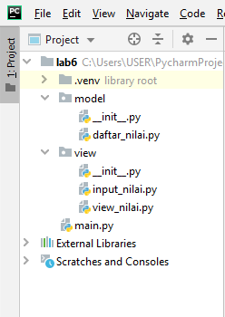
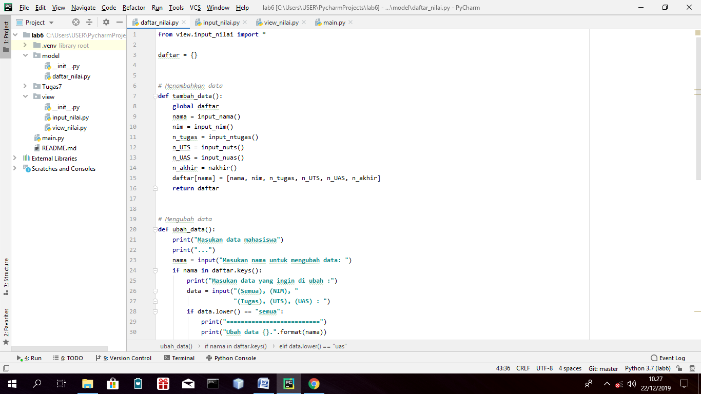
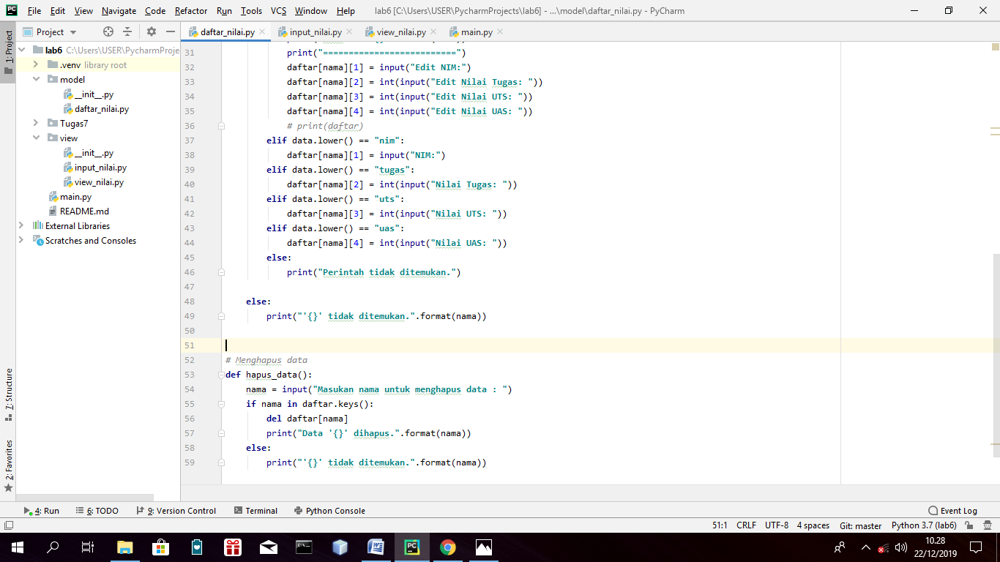
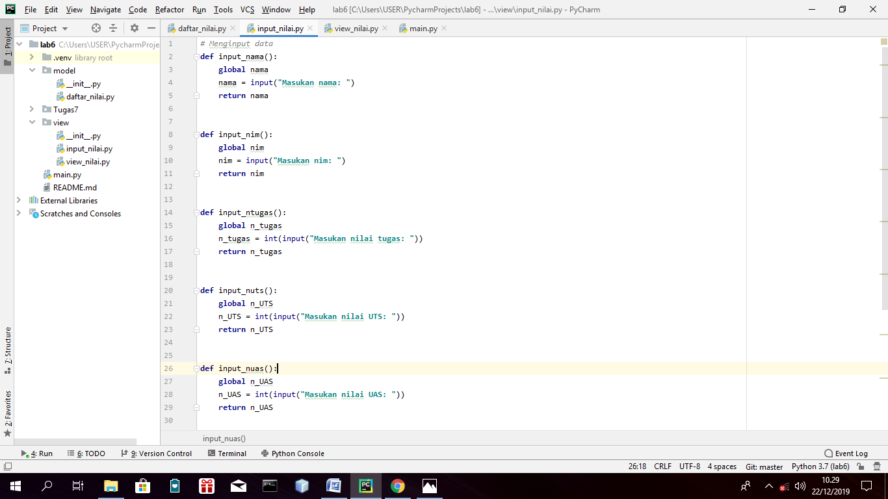
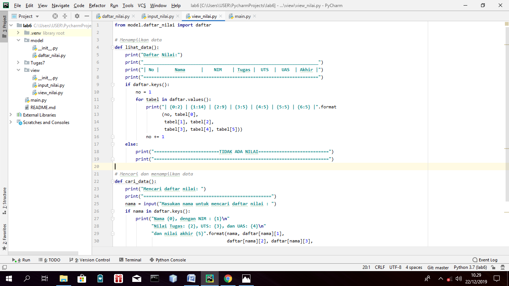
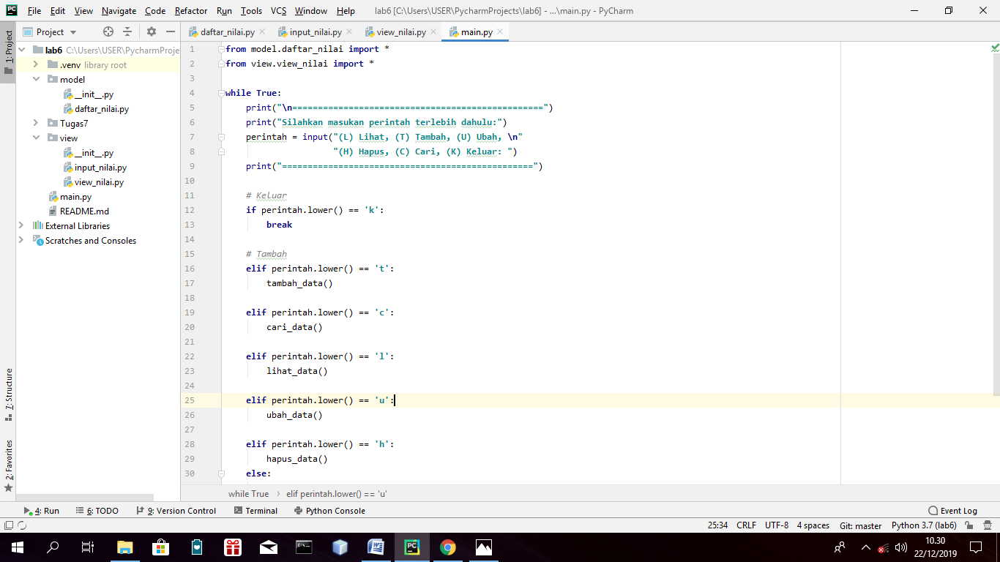
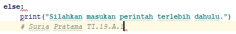
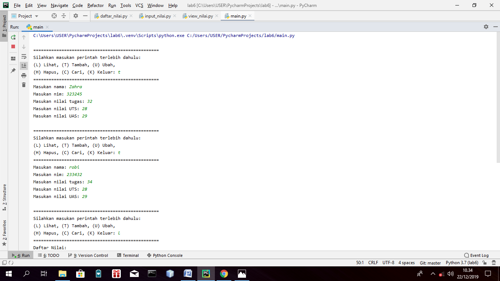
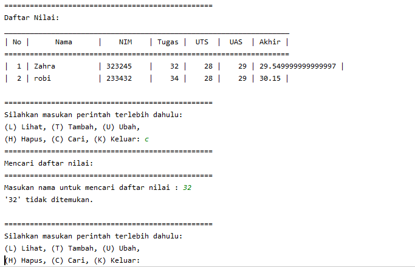

# Module & Package

# Module
# Pengertian Module
- Modul merupakan bagian dari program yang berisi fungsi-fungsi yang dibuat pada file terpisah.
- Dengan adanya modul-modul yang terpisah, dapat dikelompokkan sesuai dengan fungsinya dan memudahkan dalam mengelola kode program.
- Modul dapat dipanggil sesuai dengan kebutuhannya.

# Membuat Module
untuk membuat Module pada python cukup mudah
- Buat sebuah file kode program python (ekstensi .py)
- Buat fungsi pada file tersebut

contoh:

      # Python Module example 
       def add(a, b):
            """This program adds two   numbers and return the result"""
      
      result = a + b   
      return result
# Menggunakan Module
- Untuk menggunakan modul yang telah dibuat cukup menggunakan perintah import

contoh:

       >>> import example
       >>> example.add(4,5.5)
       9.5
    
# Package
# Pengertian Package
- Package merupakan namespace yang berisi banyak modul dan paket.
- Package merupakan sebuah direktory yang berisi banyak file-file modul.
- Setiap package pada Python, harus ada file khusus yang bernama _ _ i n i t _ _ . p y 
- File tersebut merupakan file kosong, atau bisa juga diisi dengan sesuatu.

# Membuat Package
Untuk membuat package pada Python cukup mudah. 
- Buat sebuah directory (folder), dan tambahkan file kosong dengan nama _ _ i n i t _ _ . p y 
- Buat sejumah file kode program python (ekstensi .py) pada folder tersebut yang berisi fungsi-fungsi (modul program)

# Menggunakan Package
- Untuk menggunakan package yang telah dibuat cukup menggunakan perintah import

contoh:
    
      import nama_package.nama_module
      atau 
      from nama_package import nama_module
    
# Membuat package dan modul berdasarkan tugas praktikum sebelumnya dengan struktur seperti berikut: 
-  daftar_nilai.py berisi modul untuk: tambah_data, ubah_data, hapus_data, dan cari_data
-  view_nilai.py berisi modul untuk: cetak_daftar_nilai, cetak_hasil_pencarian 
-  input_nilai.py berisi modul untuk: input_data yang meminta pengguna memasukkan data. 
-  main.py berisi program utama (menu pilihan yang memanggil semua menu yang ada)

# Package & Module
# 

# daftar_nilai
# 
# 

# input_nilai
# 

# view_nilai
# 

# main
# 
# 

# Output
# 
# 

Demikian untuk praktikum saya hari ini saya ucapkan terimakasih
